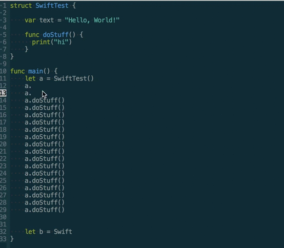

# company-swifty

Emacs swift code completion based on sourcekitten. The elisp part code was shamelessly copied from sellout@ on github with some small tweaks. This project is mainly to test out sourcekitten in a real project.

By merely invoking sourcekitten from commandline is too slow for multi-module projects. A more decent solution is to build some backend cache to speed up completion.

There are still a lot of issues with the completion, but the below screenshot gives some tastes.

I'm not motivated to update this project anymore.

